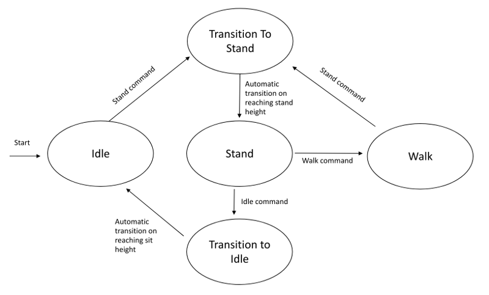

# Spot Micro Quadruped Project


Video of robot: https://www.youtube.com/watch?v=S-uzWG9Z-5E

* [Overview](#Overview)
* [General Instructions](#general-instructions)
* [Description of ROS Nodes](#description-of-ros-nodes)
* [Future Work](#future-work)
* [External Links](#external-links)

## Overview
This project is the source code for a Spot Micro quadruped, a 4 legged open source robot. This code is capable of keyboard control of a spot micro robot with sit, stand, angle command, and walk capability. The software is implemented on a Raspberry Pi 3B computer running Ubuntu 16.04.

The software is composed of C++ and python nodes in a ROS framework.

### Hardware:
The frame utilized is the Thingverse Spot Micro frame developed by KDY0523. See the thingverse page below for additional details for assembly hardware. The files for cls6336hv servos were printed which also fit the hv5523mg servos I used.
https://www.thingiverse.com/thing:3445283

Component List:
* Computer: Raspberry Pi 3B 
* Servo control board: PCA9685, controlled via i2c
* Servos: 12 x PDI-HV5523MG
* LCD Panel: 16x2 i2c LCD panel
* Battery: 2s 4000 mAh Lipo, direct connection to servo board for servo power
* UBEC: HKU5 5V/5A ubec, used as 5v voltage regulator to power raspberry pi, lcd panel, pca9685 control board.

Servos are connected in the following order to the PCA 9685 control board:
1. Right front knee
2. Right front shoulder
3. Right front hip
4. Right back knee
5. Right back shoulder
6. Right back hip
7. Left back knee
8. Left back shoulder
9. Left back hip
10. Left front knee
11. Left front shoulder
12. left front hip

A custom shoulder assembly was created that utilizes an additional piece to provide more reinforcement to the shoulder axis. The modified shoulder assembly parts can be found [at this thingverse page.](https://www.thingiverse.com/thing:4591999) Additionally, a plain center mounting platform and two convenience platforms for the RPI 3 and PCA9685 boards can be found [at this thingverse page](https://www.thingiverse.com/thing:4596267). These are affixed to the main platform by double sided foam tape.

#### Software:
This repo is structured as a catkin workspace in a ROS Kinetic envivornment on linux. Raspberry pi images preloaded with a ROS Kinetic installation can be found via ubiquity robotics. See webpage for download, setup, and wifi setup instructions: https://downloads.ubiquityrobotics.com/. It is suggested to also install ROS Kinetic on a Ubuntu 16.04 linux installation/dual boot/virtual machine on a PC for development and for running control nodes.

**NOTE**  Adding a SWAP partition of about 1 GB on the RPI's sd card is necessary to increase the virtual memory available beyond the RPI's onboard RAM. In my experience the catkin compilation process uses all the onboard RAM and stalls indefinitely and does not complete without adding a SWAP partition. Example instructions forhow to do this can be found here: https://nebl.io/neblio-university/enabling-increasing-raspberry-pi-swap/ 

The provided ROS Catkin make build system can be utilized, but I used catkin tools instead (https://catkin-tools.readthedocs.io/en/latest/). Compilation commands below will be given assuming catkin tools.

This repo should be checked out to a catkin workspace on the raspberry pi so the directory structure appears as follows. If not already available, a catkin workspace can be created or transitioned from a catkin make workspace using catkin tools. Make sure to also checkout git submodules.

```
catkin_ws/
│
├── src/
│   ├── spot_micro_motion_cmd
│   │   └── ...
│   ├── spot_micro_keyboard_cmd
│   │   └── ...  
│   └── ...
```

Configure catkin tools so cmake Release flag is added. This speeds up code execution. Alternatively, if you want to debug through an IDE such as VSCode, use build type Debug so debug symbols are generated:
    `catkin config --cmake-args -DCMAKE_BUILD_TYPE=Release`

Compile spot_micro_motion_cmd and i2cpwm_board nodes via catkin tools. The command below will automatically build i2cpwmboard in the process as it is a dependency. E.g.: 
`catkin build spot_micro_motion_cmd` 

Or just build entire project:
`catkin build`

#### Note on Walking Gaits
The gait implemented on master is a 8 phase gait that incorporates body movement which helps maintain balance and stability. An alternate trot gait, where the diagonal legs move simultaneously, can achieve faster walking speeds, but is less stable and requires careful positioning of the robot's center of mass. The trot gait is the one depicted in the animation at the top of this document, and can be found on the branch to this project titled `alternate_gait`. The 8 phase gait can be observed in the linked Youtube video.

## General Instructions
This section attemps to be a full set of instructions to get a spot micro robot calibrated and running with this code.

#### Servo Configuration

Comprehensive instructions for servo installation, calibration, and configuration can be found in [servo_calibration](servo_calibration.md) markdown document.

#### Running:
Open at least 3 ssh sessions to the raspberry pi (e.g. via tmux for convenience). Start at least the the following 3 nodes, some are optional as noted:
* `rosrun i2cpwm_board i2cpwm_board`: Runs the i2c pwm servo control board node, must be run first as it is sent a servo configuration message by the spot_micro_motion_cmd node.
* `roslaunch spot_micro_motion_cmd spot_micro_motion_cmd.launch`: Launches the compiled spot micro motion cmd binary. It first sends a servo configuration message to the i2cpwm board node, then starts a state machine and enters idle mode
* `rosrun spot_micro_keyboard_command spotMicroKeyboardMove.py` : Runs the keyboard control node for issuing keyboard commands to the spot micro robot
* (OPTIONAL) `rosrun lcd_monitor sm_lcd_node.py`: Runs the lcd monitor node to display some basic state and command data on the lcd panel. Must be run on the raspberry pi
* (OPTIONAL) `rosrun spot_micro_plot spotMicroPlot.py`: Runs a real time plotting node that shows the wireframe state of the robot. Must be run on a PC that can see the raspberry pi as a ROS master node, as it displays a figure the screen. Requires updated matplot lib python library.


#### Control instructions:
The robot software is driven by a finite state machine of discreet control modes. On the terminal running the spot_micro_keyboard_command node, keyboard commands are issued to move through the state machine and also to command body rates and angle commands.

After all sfotware is started, type in and issue `stand` command in the keyboard control node terminal to command the robot to stand up. From here, either an `idle` command can be issued to sit back down and set the servos to idle, or `angle_cmd` can be issued to command body orientation angles, or `walk` can be issued to enter walk mode.

In angle_cmd mode, the keys `w` and `s` are used to control pitch, `a` and `d` to control roll, and `q` and `e` to control yaw. `u` is used to exit back to control mode input.

In walk command mode, the keys `w` and `s` are used to control forward speed, `a` and `d` to control side speed, and `q` and `e` to control yaw rate. `u` is used to exit back to stand mode.

Note that the software does not currently support any command limits so deleterious or even hardware damaging behavior may be experienced if commanding orienetations or body rates beyond the capability of the robot.

Typing quit at the command input will quit the program with the servos fixed at their previous commanded value. Thus is it reccomended to put the robot in idle before quitting. In idle mode servos are commanded such that they hold no fixed position and can "free wheel".

## Description of ROS Nodes
* **spot_micro_motion_cmd**: Main node running robot control software. Takes in state event commands and motion commands, outputs servo control commands. Utilizes a yaml configuration file for various software settings. Consists of a state machine with 5 states and the following mode diagram: 



The default gait is a walk style gait that consists of 8 phases, swings only one leg at a time, and shifts the body in between leg swings to balance the body over the 3 legs that remain on the ground. No speed or angle command limits are implemented in the software, but the inverse kinematics model does cruide trigonometric domain function limiting to avoid math errors.

A yaml confguration file is used for holding various software configuration settings, including servo configuration dictionaries. Servo's can be calibrated using the servo_move_keyboard node, a calibration of angles via eye is sufficient for the reasonable performance.

* **i2cpwm_board**: Node that controls the pca 9685 servo control board. Operates mostly under proportional control mode, but also in absolute control mode to command servos to idle

* **spot_micro_keyboard_command**: Node that runs sends state, motion, and rate commands to the control node via input keyboard commands

* **lcd_monitor**: Node that displays basic state information and control values on the lcd monitor

* **spot_micro_plot**: Displays a wireframe figure of the robot via matplotlib and received state data from spot_micro_motion_cmd. This plot node can be used in lieu of the real robot for testing motions if the debug_mode parameter in the spot_micro_motion_cmd yaml file is set true.

* **servo_move_keyboard**: A python node that can be used in conjuction with the i2cpwm_board node to manually command an individual servo via keyboard controls. Can be used for servo calibration to build the servo configuration dictionary.


## Future Work
The current software supports basic state machine operation of the spot micro robot, orientation control at rest, and rate command in forward, sideways, and yaw directions, completely through external command messages.

My desired future goals for this project, in order of preference, are to:
1. Incorporate a lidar (particularly the Slamtec RPLIDAR A1) to achieve simple 2D mapping of a room via SLAM. This may require the addition of an IMU for robot orientation sensing (for example, an Adafruit 9-DOF IMU BNO055).
2. Develop an autonomous motion planning module to guide the robot to execute a simple task around a sensed 2D environment. For example, navigate the perimeter of a room, and dynamically avoid introduced obstacles.
3. Incorporate a camera or webcam and create a software module to conduct basic image classification. For example, perceive a closed fist or open palm, and have the robot react in specific ways to each.

## External Links
Spot Micro AI community: https://gitlab.com/custom_robots/spotmicroai

Research paper used for inverse kinematics: 
`Sen, Muhammed Arif & Bakircioglu, Veli & Kalyoncu, Mete. (2017). 
Inverse Kinematic Analysis Of A Quadruped Robot.
International Journal of Scientific & Technology Research. 6.`

Stanford robotics for inspiration for gait code: https://github.com/stanfordroboticsclub/StanfordQuadruped


