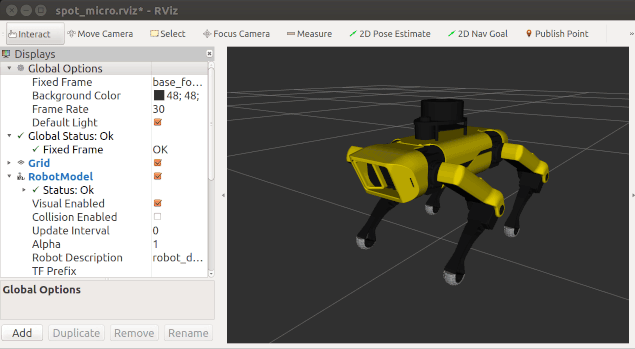
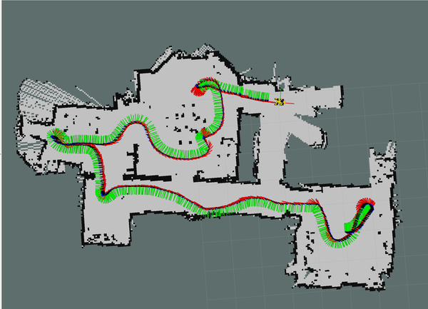

# Spot Micro Quadruped Project






Video of robot: https://www.youtube.com/watch?v=S-uzWG9Z-5E

* [Overview](#Overview)
* [General Instructions](#general-instructions)
* [Description of ROS Nodes](#description-of-ros-nodes)
* [Additional Project Components](#additional-project-components)
    * [URDF](#urdf-model)
    * [TF2 Publishing and Odometry](#tf2-publishing-and-odometry)
    * [SLAM](#slam)
* [Future Work](#future-work)
* [External Links](#external-links)

## Overview
This project is the source code for a Spot Micro quadruped, a 4 legged open source robot. This code implements motion control of a 3d printed spot micro robot, including sit, stand, angle and walk control. Supporting libraries provide additional capabilities, such as mapping through SLAM and a body mounted lidar. The software is implemented on a Raspberry Pi 3B running Ubuntu 16.04 with ROS Kinetic installed.

The software is composed of C++ and Python nodes in a ROS framework.

#### Hardware:
The frame utilized is the Thingverse Spot Micro frame developed by KDY0523. See [the thingverse page](https://www.thingiverse.com/thing:3445283) for additional details for assembly hardware. The files for cls6336hv servos were printed which also fit the hv5523mg servos I used.

Component List:
* Computer: Raspberry Pi 3B 
* Servo control board: PCA9685, controlled via i2c
* Servos: 12 x PDI-HV5523MG
* LCD Panel: 16x2 i2c LCD panel (Optional)
* Battery: 2s 4000 mAh Lipo, direct connection to servo board for servo power
* UBEC: HKU5 5V/5A ubec, used as 5v voltage regulator to power raspberry pi, lcd panel, pca9685 control board.
* Lidar: RPLidar A1
* Custom 3d printed parts for mounts and reinforcements

More information about the hardware, including the additional custom 3d printed parts, coordinate system information, and sample hardware installation photos, can be found in the [additional hardware description](docs/additional_hardware_description.md) document.


#### Software:
This repo is structured as a catkin workspace in a ROS Kinetic envivornment on Ubuntu 16.04. The software may not work or compile outside this environment. Raspberry Pi images preloaded with Ubuntu 16.04 and a ROS Kinetic installation can be found via ubiquity robotics. [See ubiquity robotics webpage](https://downloads.ubiquityrobotics.com/) for download, setup, and wifi setup instructions. It is suggested to also install ROS Kinetic on a Ubuntu 16.04 linux installation/dual boot/virtual machine on a PC for development and for running control nodes. Instructions to install ROS kinetic can be found [here](http://wiki.ros.org/kinetic/Installation/Ubuntu).

**NOTE**  A SWAP partition of about 1 GB on the RPI's sd card is necessary to increase the virtual memory available beyond the RPI's onboard RAM. In my experience the catkin compilation process uses all the onboard RAM and stalls indefinitely and does not complete without adding a SWAP partition. Example instructions for adding a SWAP partition [can be found here](https://nebl.io/neblio-university/enabling-increasing-raspberry-pi-swap/). 

The provided ROS Catkin make build system can be utilized, but I used `catkin tools` instead ([see catkin tools website]((https://catkin-tools.readthedocs.io/en/latest/))). Compilation commands below will be given assuming `catkin tools`. If not using catkin tools on the raspberry pi, the stock `catkin_make` can be used to compile the code via command such as `catkin_make -DCMAKE_BUILD_TYPE=Release` from the home of the catkin workspace.

##### Software Checkout and Setup:

This repo should be checked out to a catkin workspace on the raspberry pi so the directory structure appears as below. If not already available, a catkin workspace can be created or transitioned from a catkin make workspace using catkin tools ([or if using stock ROS tools, see tutorial pages for creating a catkin workspace](http://wiki.ros.org/catkin/Tutorials/create_a_workspace)). If you don't have the pi connected to the internet you could use the catkin commands to create the workspace on another conputer, then copy the files to a RPi over wifi via scp. For example: `scp spotMicro/* ubuntu@10.42.0.1:~/catkin_ws/src/`.

```
catkin_ws/
│
├── src/
│   ├── spot_micro_motion_cmd
│   │   └── ...
│   ├── spot_micro_keyboard_cmd
│   │   └── ...  
│   └── ...
```

Note that this repo utilizes two git submodules, which require additional steps to check out. After checking out the main repo, checkout the submodules via:

```
git submodule update --init --recursive
git submodule update --recursive
```

If any git permission errors are encountered, try the following suggestions via [this stackoverflow post](https://stackoverflow.com/questions/8197089/fatal-error-when-updating-submodule-using-git).

Since the same repo is checked out on both a pi and a laptop/PC, you will need to install an i2c library on the laptop/pc for the software to compile correctly. The `i2cpwm_board` node is not run on the laptop/pc, but compilation will look for dependencies for this node. Install the necessary library via:
`sudo apt-get install libi2c-dev`

Configure catkin tools so cmake Release flag is added. This speeds up code execution. Alternatively, if you want to debug through an IDE such as VSCode, use build type Debug so debug symbols are generated:
`catkin config --cmake-args -DCMAKE_BUILD_TYPE=Release`

Compile spot_micro_motion_cmd and i2cpwm_board nodes via catkin tools. The command below will automatically build i2cpwmboard in the process as it is a dependency. E.g.: 
`catkin build spot_micro_motion_cmd` 

Or just build entire project:
`catkin build`

If you get an error like the below when running on the pi its likely you are missing the libi2c-dev, which may not be installed in the rpi image you download. To fix this, you could install the library on your pi with an `apt-get` command. If you don't have internet on the pi, you can download the file as a debian `.deb` package to your main computer with the right version for ubuntu 16.04 (https://ubuntu.pkgs.org/16.04/ubuntu-universe-amd64/libi2c-dev_3.1.1-1_all.deb.html) and then copy the file via `scp` to the pi (`scp libi2c-dev_3.1.1-1_all.deb ubuntu@10.42.0.1:~/`) and and install it manually (`sudo dpkg -i libi2c-dev_3.1.1-1_all.deb`).
```
ros-i2cpwmboard/CMakeFiles/i2cpwm_board.dir/build.make:62: recipe for target 'ros-i2cpwmboard/CMakeFiles/i2cpwm_board.dir/src/i2cpwm_controller.cpp.o' failed
make[2]: *** [ros-i2cpwmboard/CMakeFiles/i2cpwm_board.dir/src/i2cpwm_controller.cpp.o] Error 1
CMakeFiles/Makefile2:2343: recipe for target 'ros-i2cpwmboard/CMakeFiles/i2cpwm_board.dir/all' failed
```

#### Note on Walking Gaits
The default gait implemented is a 8 phase gait that incorporates body movement which helps maintain balance and stability. An alternate trot gait, where the diagonally opposite legs move simultaneously, can achieve faster walking speeds, but is less stable and requires careful positioning of the robot's center of mass. The trot gait is the one depicted in the animation at the top of this document. See the `spot_micro_motion_cmd` node's config file for information on how to switch to the trot gait. The 8 phase gait can be observed in the linked Youtube video.

## General Instructions
This section attemps to be a full set of instructions to get a spot micro robot calibrated and running with this code.

#### Servo Configuration

Comprehensive instructions for servo installation, calibration, and configuration can be found in [servo_calibration](docs/servo_calibration.md) document.

#### Running:
Open at least two terminal windows, with at least one ssh'ed to the raspberry pi. I reccomend using a terminal multiplexer such as `tmux` for convenience. Start the following launch files in the respective terminals:
* `roslaunch spot_micro_motion_cmd motion_cmd.launch`: Run on the Raspberry Pi. Launches the i2c_pwmboard node as well as the robot's motion control node. On startup, the motion command node sends a servo configuration message to the i2c_pwmboard node, then starts a state machines and enteres an idle state.
* `roslaunch spot_micro_keyboard_command keyboard_command.launch` Run on a local machine. Launches the keyboard command node, for issuing keyboard commands to the spot micro robot
* **OPTIONAL**: The above two launch files can take optional command line arguments to start additional nodes. Some of the command line arguments are listed below.
    * Command line arguments for `motion_cmd.launch`:
        * `run_standalone:=true`: Runs the motion command node standalone (without running the i2c_pwmboard node)
        * `debug_mode:=true`: Overrides the `debug_mode` parameter to true. Useful in combination with `run_standalone` for running or debugging the motion command node on a PC instead of the RPi
        * `run_lcd:=true`: Runs the lcd monitor node to display simple state information on a LCD monitor if installed. Only works running on a RPi
    * Command line arguments for `keyboard_command.launch`:
        * `run_rviz:=true`: Starts RVIZ and displays a 3d model of the robot with state update in real time.
        * `run_plot:=true`: Runs python plotting node to display a stick figure wireframe model of the spot micro robot state in real time. Must be run on a PC. Requires updated matplot lib python library (matplotlib 2.2.5) and updated numpy library (numpy 1.16.6).
* For running SLAM, see the [SLAM document](docs/slam_information.md) for more information, which is also referenced in the [Additional Project Components](#additional-project-components) section.
        

Stopping and exiting the keyboard command launch file may require typing `quit` and pressing `Ctrl-C`, as well as closing any plot windows if plotting was utilized. 

Command line arguments are added to the end of a `roslaunch` command, and multiple arguments can be appended at once, for example:
`roslaunch spot_micro_motion_cmd motion_cmd.launch run_standalone:=true debug_mode:=true`

The launch files are an included convenience, but if needed, nodes can be run individuallay via `rosrun` (except for spot_micro_motion command which must be launched by launch file to read in parameters). For example, the minimum required nodes could be run with the following three commands in three seperate terminals:
* `rosrun i2cpwm_board i2cpwm_board` 
* `roslaunch spot_micro_motion_cmd motion_cmd.launch run_standalone:=true`
* `rosrun spot_micro_keyboard_command spotMicroKeyboardMove.py`


#### Control instructions:
The robot software is driven by a finite state machine of discreet control modes. On the terminal running the spot_micro_keyboard_command node, keyboard commands are issued to move through the state machine and also to command body rates and angle commands.

After all sfotware is started, type in and issue `stand` command in the keyboard control node terminal to command the robot to stand up. From here, either an `idle` command can be issued to sit back down and set the servos to idle, or `angle_cmd` can be issued to command body orientation angles, or `walk` can be issued to enter walk mode.

In angle_cmd mode, the keys `w` and `s` are used to control pitch, `a` and `d` to control roll, and `q` and `e` to control yaw. `u` is used to exit back to control mode input.

In walk command mode, the keys `w` and `s` are used to control forward speed, `a` and `d` to control side speed, and `q` and `e` to control yaw rate. `u` is used to exit back to stand mode.

Note that the software does not currently support any command limits so deleterious or even hardware damaging behavior may be experienced if commanding orienetations or body rates beyond the capability of the robot.

Typing `quit` at the command input will quit the program with the servos fixed at their previous commanded value. Thus is it reccomended to put the robot in idle before quitting. In idle mode servos are commanded such that they hold no fixed position and can "free wheel".

## Description of ROS Nodes
* **spot_micro_motion_cmd**: Main node running robot control software. Takes in state event commands and motion commands, outputs servo control commands. Utilizes a yaml configuration file for various software settings. Consists of a state machine with 5 states and the following mode diagram: 


The default gait is a walk style gait that consists of 8 phases, swings only one leg at a time, and shifts the body in between leg swings to balance the body over the 3 legs that remain on the ground. No speed or angle command limits are implemented in the software, but the inverse kinematics model does cruide trigonometric domain function limiting to avoid math errors.

A yaml confguration file is used for holding various software configuration settings, including servo configuration dictionaries. Servo's can be calibrated using the servo_move_keyboard node, a calibration of angles via eye is sufficient for the reasonable performance.

* **i2cpwm_board**: Node that controls the pca 9685 servo control board. Operates mostly under proportional control mode, but also in absolute control mode to command servos to idle

* **spot_micro_keyboard_command**: Node that sends state, motion, and rate commands to the motion control node via keyboard

* **lcd_monitor**: Node that displays basic state information and control values on the lcd monitor

* **spot_micro_plot**: Displays a wireframe figure of the robot via matplotlib and received state data from spot_micro_motion_cmd. This plot node can be used in lieu of the real robot for testing motions if the spot_micro_motion_cmd node is run standalone, and with the debug_mode parameter set true.

* **servo_move_keyboard**: A python node that can be used in conjuction with the i2cpwm_board node to manually command an individual servo via keyboard controls. Can be used for servo calibration to build the servo configuration dictionary.

* **spot_micro_rviz**: A node to launch RVIZ and show a visualization of the spot micro model, as well as mapping and navigational elements in the future. The `show_and_move_model_via_gui` launch file can be launched standalone to show a manually moveable spot micro model via GUI sliders. 

Note that the servo control node `i2cpwm_board` should only be commanded by one node at one time. Thus `spot_micro_motion_command` and `servo_move_keyboard` should be run exclusionary; only one should ever run at one time.

* **spot_micro_launch**: Not a node, but a launch package purely for collecting high level launch files. The launch files are for more advanced use cases such as running SLAM. 

## Additional Project Components
#### URDF Model
The project contains a URDF model of the spot micro platform, along with a custom set of stl files  for visualization. The URDF file was pulled from Florian Wilk's repo, noted at the end of this README, and modified to change the coordinate system orientation, and the dimensions to match dimensions of my spot micro robot. Currently this urdf file is **only** used for RVIZ visualization of the spot micro model. This URDF model should not be treated as perfectly accurate representation of the robot's geometry, nor should the STL files in this repo be used for 3d printing. Use the noted Thingverse files instead. 

The URDF model is defined as a `xacro` file, which is a way to define urdf file using macros to automate certain generative actions. The xacro file is located in the `spot_micro_rviz/urdf` directory. A urdf file can be generated from the `.xacro` file for inspection or use, if needed, via running `xacro` after sourcing a ROS development environment. 

#### TF2 Publishing and Odometry
Robot state transforms are published via TF2. Some primary frames of interest are `base_footprint` and `base_link`, and `lidar_link`. `base_footprint` is a coordinate frame at zero height at the base of the robot frame. `base_link` is the coordinate frame fixed to the body center of the robot, and moves and rotates with body motion. `lidar_link` is a coordinate frame aligned with an installed lidar.

An odometry frame, `odom`, is optionally available and can be enabled via a configurable parameter in the `spot_micro_motion_cmd.yaml` file. If enabled, `odom` is parent to the `base_footprint` frame.  **Note that odometry is grossly inaccurate and not calibrated whatsoever**. It is a pure integration of robot rate commands and thus drifts unbounded with errors over time. It is provided for any useful purpose it may serve.

#### SLAM
If a lidar, such as a RPLidar A1, is mounted to the robot frame, 2d mapping is possible through SLAM with additional ROS nodes, such as hector_slam. More information about running SLAM through this project is described in the [SLAM information](docs/slam_information.md) document.

## Future Work
The current software supports basic state machine operation of the spot micro robot, orientation control at rest, and rate command in forward, sideways, and yaw directions, completely through external command messages.

My desired future goals for this project, in order of preference, are to:
1. ~~Incorporate a lidar (particularly the Slamtec RPLIDAR A1) to achieve simple 2D mapping of a room via SLAM. This may require the addition of an IMU for robot orientation sensing (for example, an Adafruit 9-DOF IMU BNO055).~~
2. Develop an autonomous motion planning module to guide the robot to execute a simple task around a sensed 2D environment. For example, navigate the perimeter of a room, and dynamically avoid introduced obstacles.
3. Incorporate a camera or webcam and create a software module to conduct basic image classification. For example, perceive a closed fist or open palm, and have the robot react in specific ways to each.
4. Implement a more advanced robot controller that can reject external disturbances. 

## External Links and References
* Spot Micro AI community: https://gitlab.com/custom_robots/spotmicroai

* Research paper used for inverse kinematics: 
`Sen, Muhammed Arif & Bakircioglu, Veli & Kalyoncu, Mete. (2017). 
Inverse Kinematic Analysis Of A Quadruped Robot.
International Journal of Scientific & Technology Research. 6.`

* Stanford robotics for inspiration for gait code: https://github.com/stanfordroboticsclub/StanfordQuadruped
* Spot micro URDF model copied and modified from Florian Wilk's repo
    * https://gitlab.com/custom_robots/spotmicroai/simulation/-/tree/master/Basic%20simulation%20by%20user%20Florian%20Wilk
* List of submodules utilized:
    * ros-i2cpwmboard by bradanlane for PCA9685 support
        * https://gitlab.com/bradanlane/ros-i2cpwmboard
    * spot_micro_kinematics_python by me :) for python spot micro kinematic calculations:
        * https://github.com/mike4192/spot_micro_kinematics_python 
    * spot_micro_kinematics_cpp by me :) for c++ spot micro kinematic calculations:
        * https://github.com/mike4192/spot_micro_kinematics_cpp 

