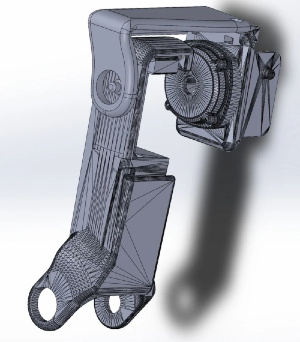
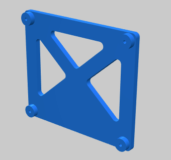
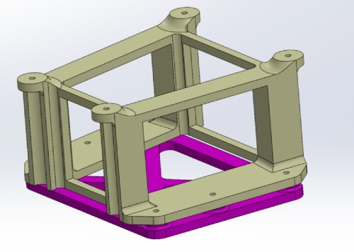
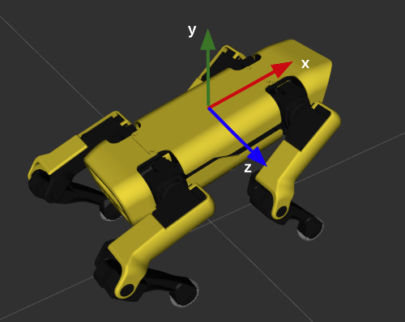
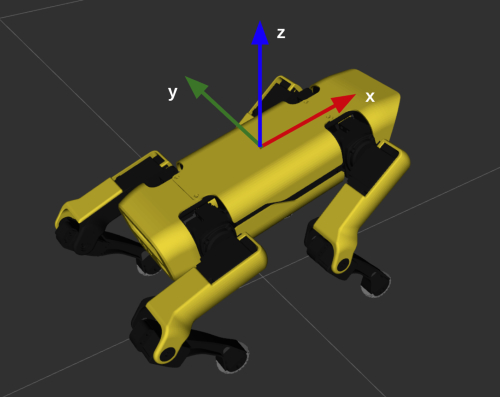
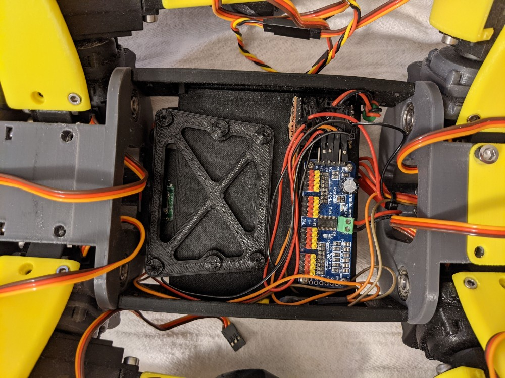
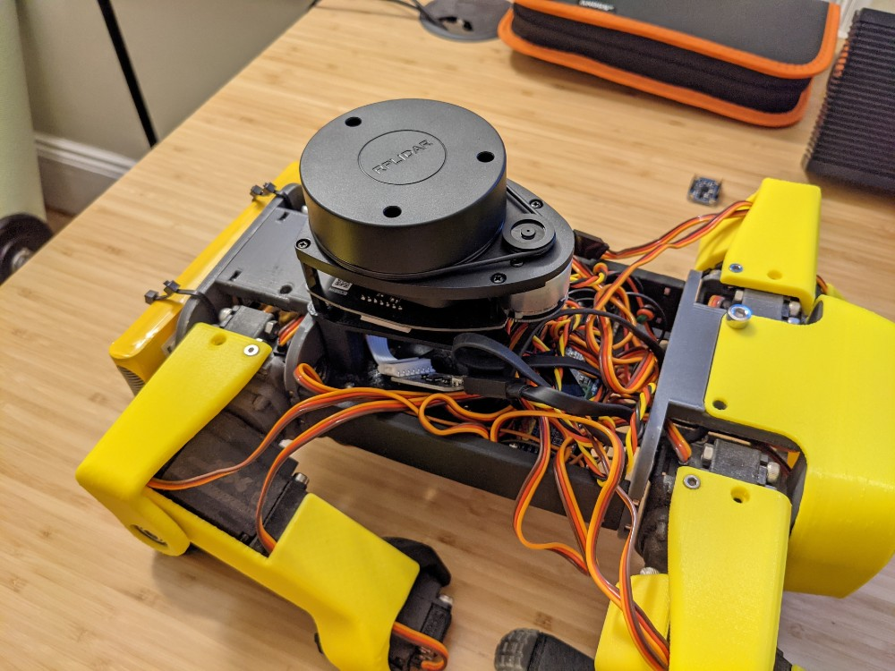
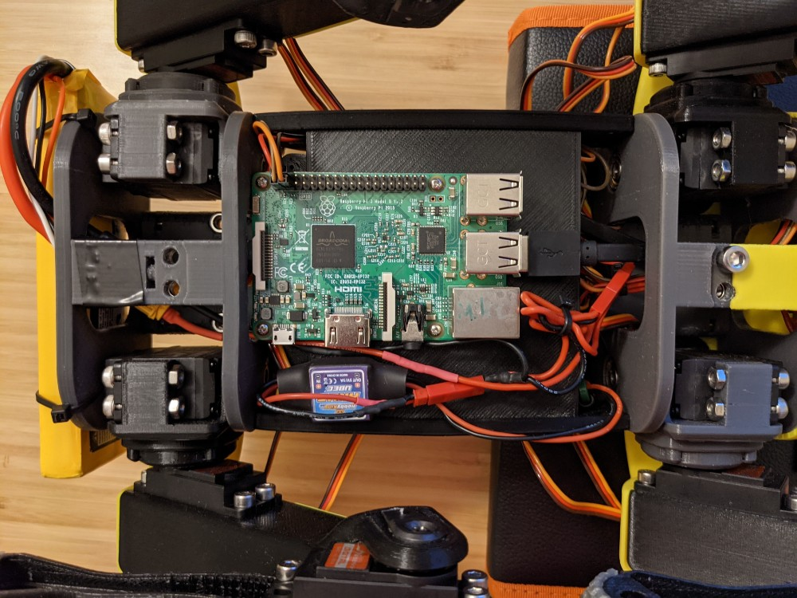

# Additional Hardware Description
This document provides some addition description of the harware for the spot micro robot.

* [Custom 3d Printed Parts](#custom-3d-printed-parts)
* [Coordinate Frames](#coordinate-frames)
* [Sample Hardware Install Photos](#sample-hardware-installation-photos)

## Custom 3d Printed Parts

Several custom 3d printed pieces were created to expand on KDY's original design. These include a custom shoulder assembly to provide additional reinforcement, and several mounting platforms for convenience. 

The modified shoulder assembly, shown below, includes an additional plastic piece to provide additional reinforcement to the shoulder axis. It requires printing an antire set of shoulder joint parts, which can be found [at this thingverse page](https://www.thingiverse.com/thing:4591999). Two sets must be printed mirrored for the opposite side's legs. The modified shoulder will require an additional 8x M3x10 screws, 8x M3 nuts, and 4x F625zz bearings in total for assembly.

A plain center body platform, and two convenience platforms for mounting the RPI 3 and PCA9685 boards can be found [at this thingverse page](https://www.thingiverse.com/thing:4596267). The Raspberry Pi platform is shown below. It can be adhered to the center platform by double sided foam tape. Small wood screws can be used are used t attach the RPi3 and PCA9685 to these platforms.

A custom platform and mount adapter for a RPLidar A1 can be found at [at this thingverse page](https://www.thingiverse.com/thing:4713180). Design courtesy of Maggie Mathiue. Like the platforms above, the base can be adhered to the center body platform by double sided foam tape. The mount adapter is attached to a RPLiadr A1 by 4x M2.5x8 screws and to the bottom platform by small wood screws.

## Coordinate Frames
There are many coordinate frames on the spot micro frame (one at each joint!), but some of the more important frames are described here.

#### Kinematics Coordinate Frame
With regard to kinematics of the robot frame, the coordinate frame is oriented as follows: X positive forward, Y positive up, Z positive left. This frame was is only relevant if working on the kinematic calculations for the robot. It is the same coordinate frame as used in the paper sourced for the inverse kinematic calculations for this project ("Inverse Kinematic Analysis Of A Quadruped Robot").

#### TF2 Coordinate Frame 
The TF2 coordinate frames is the base robot body coordinate frame used for all transforms published to TF2 within the ROS framework. This is the robot coordinate frame of interest with regard to mapping and navigation. This frame is oriented as follows: X positive forward, Y positive left, Z positive up.

## Sample Hardware Install Photos
The following photos a sample installation of components on the spot micro frame.

